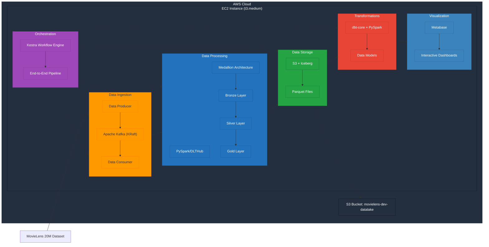

# MovieLens Streaming Data Pipeline

## Problem Statement

This project creates an end-to-end data pipeline for the MovieLens 20M dataset, processing movie ratings data to generate insights about movie popularity and viewer preferences. The goal is to demonstrate a complete data engineering workflow that:

1. Ingests movie ratings data from the MovieLens dataset
2. Processes this data through a medallion architecture (Bronze/Silver/Gold layers)
3. Transforms the data for analytics
4. Presents insights through interactive dashboards

The solution enables movie recommendation platforms to understand viewing patterns, identify popular movies by different metrics, and visualize rating distributions across genres and time periods.


## Architecture




The pipeline follows a medallion architecture pattern:
- **Bronze Layer**: Raw data ingestion
- **Silver Layer**: Cleaned and standardized data
- **Gold Layer**: Analytics-ready data

## Technologies Used

- **Cloud**: AWS (EC2, S3)
- **Infrastructure as Code**: Terraform
- **Data Lake**: S3 with medallion architecture
- **Processing**: Apache Spark
- **Data Warehouse**: Local implementation with medallion pattern
- **Workflow Orchestration**: Kestra
- **Dashboard**: Custom HTML/JavaScript visualization with Chart.js
- **Data Transformation**: Python with Pandas, Spark

## Dashboard

The project includes an interactive dashboard displaying:
1. Movie rating distribution (categorical data)
2. Movie releases and ratings by year (temporal data)
3. Top-rated movies ranked by audience scores

The dashboard is accessible at http://184.73.115.135:8081/index.html (active while the EC2 instance is running).

## Project Structure
```bash
.
├── README.md
├── check_dirs.sh
├── dashboard
│   └── generate_dashboard.py
├── datasets
│   └── download_movielens.py
├── dbt_project
│   ├── dbt_project.yml
│   └── models
│       ├── gold
│       │   └── gold_movie_analytics.sql
│       └── silver
│           └── silver_movie_ratings.sql
├── docker-compose.yml
├── dwh
│   └── query_data.py
├── iceberg
│   ├── local_medallion.py
│   ├── local_medallion_updated.py
│   ├── s3_upload.py
│   └── setup_iceberg.py
├── iceberg_warehouse
├── infra
│   ├── main.tf
│   ├── outputs.tf
│   ├── terraform.tfstate
│   ├── terraform.tfstate.backup
│   └── variables.tf
├── jars
│   ├── bundle-2.20.18.jar
│   ├── hadoop-aws-3.3.4.jar
│   └── iceberg-spark-runtime-3.3_1.3.1-1.3.1.jar
├── kafka
│   ├── movie_producer.py
│   ├── test_consumer.py
│   ├── test_producer.py
│   └── verify_consumer.py
├── kestra
│   └── flows
│       └── movielens_pipeline.yml
├── notebooks
│   └── explore_dataset.py
├── output
│   ├── analysis
│   │   └── top_movies
│   │       ├── _SUCCESS
│   │       └── part-00000-0381f6db-11b9-4b7a-9566-1935f0f6f54b-c000.csv
│   ├── dashboard
│   │   └── index.html
│   ├── dwh
│   │   ├── metabase_queries
│   │   │   ├── movies_by_year.sql
│   │   │   ├── rating_distribution.sql
│   │   │   └── top_movies.sql
│   │   ├── movies_by_year.csv
│   │   ├── movies_by_year.json
│   │   ├── rating_distribution.csv
│   │   ├── rating_distribution.json
│   │   ├── top_movies_by_rating.csv
│   │   └── top_movies_by_rating.json
│   ├── medallion
│   │   ├── bronze
│   │   │   ├── movies.parquet
│   │   │   ├── ratings.parquet
│   │   │   └── tags.parquet
│   │   ├── gold
│   │   │   ├── genre_stats.parquet
│   │   │   ├── movie_analytics.parquet
│   │   │   └── movie_genres.parquet
│   │   └── silver
│   │       ├── movies.parquet
│   │       ├── ratings.parquet
│   │       └── tags.parquet
│   └── movie_analytics.csv
├── pipeline_20250331_221330.log
├── raw
│   └── ml-20m
│       ├── README.txt
│       ├── genome-scores.csv
│       ├── genome-tags.csv
│       ├── links.csv
│       ├── movies.csv
│       ├── ratings.csv
│       └── tags.csv
├── requirements.txt
├── run_pipeline.sh
├── scripts
├── serve_dashboard.sh
├── server.log
└── spark
    ├── batch_processor.py
    ├── batch_processor_simple.py
    ├── movie_consumer.py
    ├── process_analytics.py
    ├── setup_spark.py
    └── spark_session.py
```

## Reproduction Steps

### Prerequisites
- AWS Account
- Terraform installed
- Python 3.8+
- Git

### 1. Infrastructure Setup

```bash
# Clone the repository
git clone https://github.com/schwinger42/movielens-streaming-pipeline.git
cd movielens-streaming-pipeline

# Set up AWS credentials
export AWS_ACCESS_KEY_ID="your-access-key"
export AWS_SECRET_ACCESS_KEY="your-secret-key"

# Deploy infrastructure
cd infra
terraform init
terraform apply
```
### 2. Data Download and Processing
```bash
# Download the MovieLens dataset
python3 datasets/download_movielens.py

# Run the full data pipeline
./run_pipeline.sh
```
### 3. Dashboard Access
```bash
# Start the dashboard server
./serve_dashboard.sh

# Access the dashboard at:
# http://<your-ec2-ip>:8081/index.html
```

## Results and Insights
Analysis of the MovieLens dataset revealed several interesting patterns:

* Rating Distribution: The pie chart shows that "Medium" rated movies form the largest segment, followed by "High" rated films. This indicates that users generally rate movies favorably, with a smaller portion receiving either very low or very high ratings.
* Top-Rated Films: Classic movies dominate the highest ratings list, with films like "The Godfather: Part II" (1974), "The Shawshank Redemption" (1994), and "The Godfather" (1972) securing top positions. This suggests a strong preference for established classics among reviewers.
* Historical Trends: The temporal analysis of the last 50 years shows:
  * A dramatic increase in the number of movies in the dataset starting around the mid-1990s, peaking around 2010
  * Average ratings remain relatively consistent (between 3-4 stars) across decades
  * A subtle inverse relationship between volume and ratings - periods with fewer movies tend to have slightly higher average ratings
  * A significant decline in movie count after 2014, likely reflecting the dataset's collection period rather than actual production trends


* Rating vs. Age: Older films (1970s-1990s) generally maintain higher average ratings than more recent releases, suggesting either a quality difference or a "survivor bias" where only memorable older films are rated.

These insights demonstrate the value of the medallion architecture and data pipeline in transforming raw movie ratings into actionable business intelligence that could inform content acquisition and recommendation strategies.
